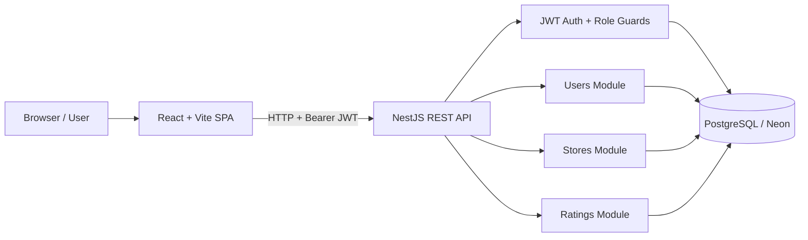
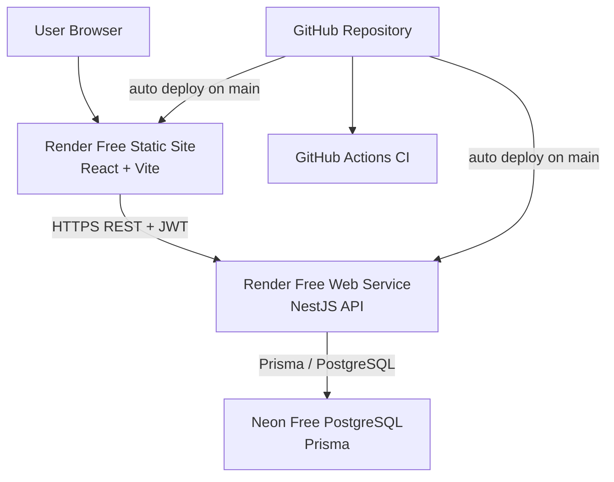
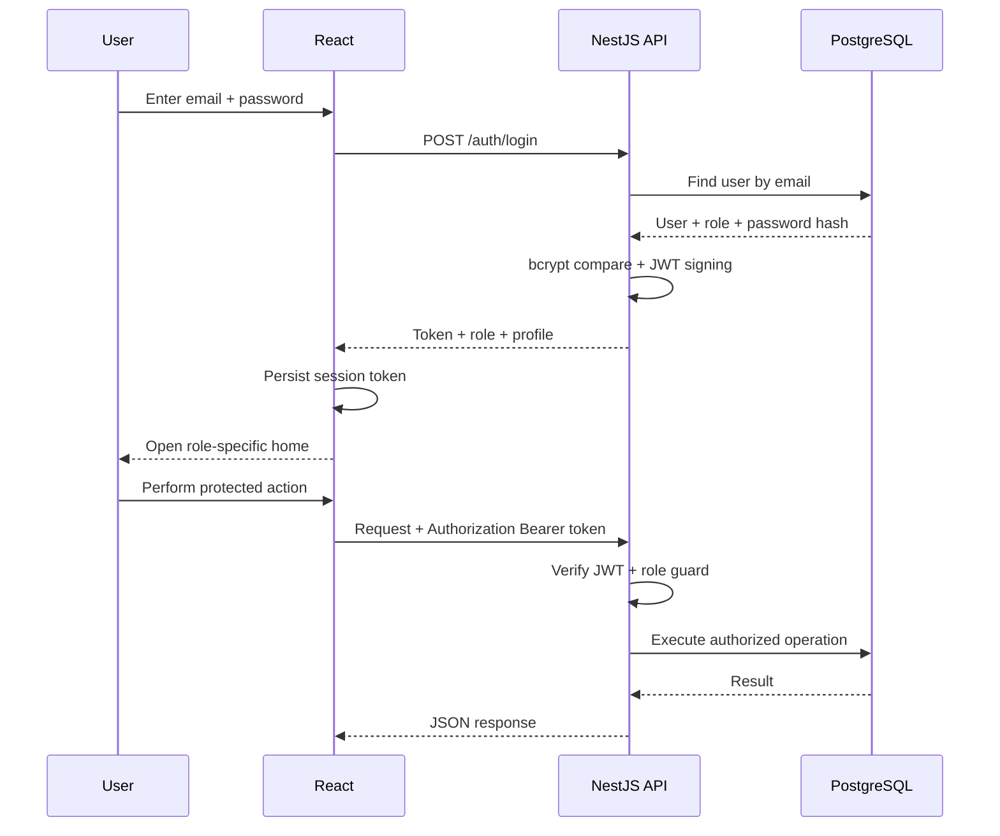
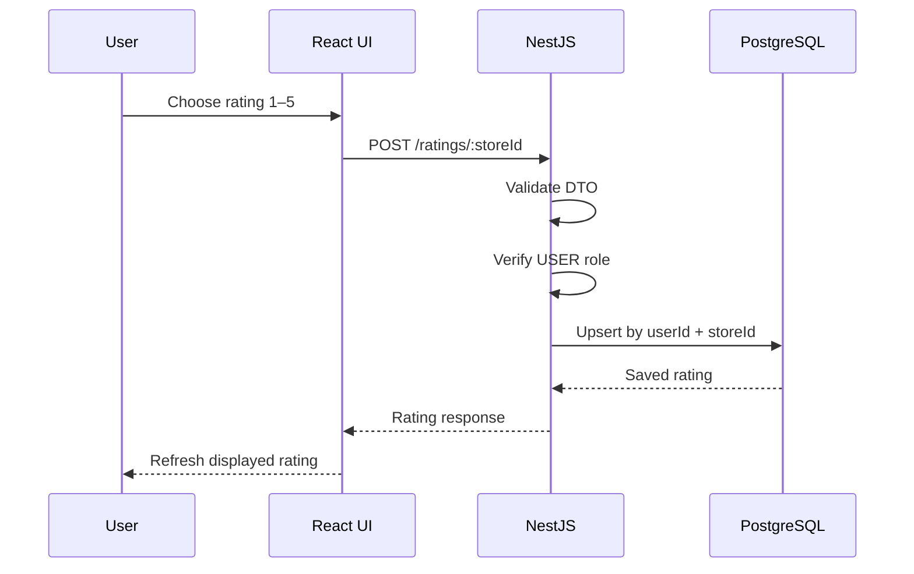
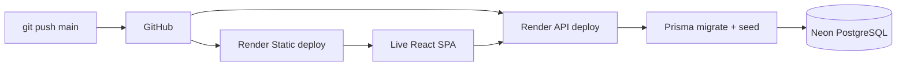

# Store Rating Platform

A production-style **role-based store rating platform** built as a full-stack assessment project using React, NestJS, PostgreSQL, Prisma, JWT authentication, and Docker.

The application implements one shared authentication flow for all users and exposes role-specific screens and API permissions for:

- **System Administrator**
- **Normal User**
- **Store Owner**

## Live deployment

| Component | Free service | URL |
| --- | --- | --- |
| Frontend | Render Static Site | https://store-rating-platform-web.onrender.com |
| Backend API | Render Web Service | https://store-rating-platform-api.onrender.com/api |
| PostgreSQL | Neon | Managed PostgreSQL database |
| Source code | GitHub | https://github.com/affanSkhan/store-rating-platform |

> **Free-tier note:** the deployed application is intentionally running on free infrastructure. Free web services can sleep when idle, so the first request after inactivity may take longer than subsequent requests. The database and application are stateless from the frontend's perspective, and the deployment does not depend on a paid service.

## CI

[](https://github.com/affanSkhan/store-rating-platform/actions/workflows/ci.yml)

The repository includes GitHub Actions checks for the client and server. The API also contains dedicated unit tests for authentication and rating behavior.

---

## 1. Project overview

The platform is designed around a simple rule: **one login entry point, role-based authorization after authentication**.

After successful authentication, the backend returns a signed JWT containing the authenticated identity and role. The React client stores the session token and routes the user to the appropriate dashboard. Backend guards remain the source of truth, so changing client-side navigation cannot grant additional API permissions.

The application also demonstrates database-level integrity, DTO validation, pagination, filtering, deterministic sorting, password hashing, protected routes, and a reproducible Prisma migration.

### Core capabilities

| Role | Capabilities |
| --- | --- |
| **System Administrator** | Dashboard statistics, create users, create stores, filter/sort listings, inspect user details, manage role-specific accounts |
| **Normal User** | Signup, login, browse/search stores, view aggregate rating, submit 1–5 ratings, update own rating, change password |
| **Store Owner** | Login, view owned-store average rating, view users who rated the store, view submitted rating values, filter/sort rating activity, change password |

---

## 2. Assessment requirements coverage

| Requirement | Implementation |
| --- | --- |
| One login for all roles | Shared `POST /auth/login` with role-aware response and route guards |
| Normal-user signup | `POST /auth/signup` and dedicated React signup form |
| Ratings from 1–5 | DTO validation + database `SmallInt` field + service-level validation |
| One rating per user/store | Prisma composite unique constraint on `(userId, storeId)` |
| Update existing rating | Rating upsert/update flow for the same user/store pair |
| Admin dashboard | User, store, and rating counts |
| Admin creates users | Admin user-management endpoint with role selection |
| Admin creates stores | Admin store-management endpoint |
| Admin filters listings | Name, email, address, role filters where applicable |
| Admin sorting | Whitelisted sort fields mapped to Prisma `orderBy` |
| User store search | Name/address query filtering |
| User store sorting | Store name and address ascending/descending controls |
| Store owner dashboard | Average rating + rating activity list |
| Password change | Authenticated password-change flow |
| Validation rules | Backend DTO validation plus matching frontend constraints |
| PostgreSQL | Neon-hosted PostgreSQL for deployment, Docker PostgreSQL locally |
| Best-practice schema | Foreign keys, indexes, unique constraints, timestamps, normalized entities |
| Authentication security | JWT + bcrypt password hashing + role guards |
| Frontend/backend separation | React SPA + NestJS REST API |
| Reproducible database setup | Committed Prisma migration + idempotent seed script |
| CI | GitHub Actions workflow |
| Free deployment | Neon free database + Render free API/static hosting |

---

## 3. Technology stack

### Frontend

- React
- Vite
- React Router
- Axios
- Functional components + hooks
- Context-based authentication state
- Responsive dashboard-style UI

### Backend

- NestJS
- TypeScript
- REST API
- `class-validator` / `class-transformer`
- JWT authentication
- Passport JWT strategy
- bcrypt password hashing
- Helmet security headers
- Config module with environment validation

### Data layer

- PostgreSQL
- Prisma ORM
- UUID primary keys
- Composite uniqueness for ratings
- Indexed search/sort fields
- Foreign keys with explicit delete behavior
- Prisma migrations

### Local infrastructure

- Docker Compose
- PostgreSQL container

### Deployment

- **Neon:** PostgreSQL
- **Render:** backend web service
- **Render:** React static site
- **GitHub Actions:** CI

---

## 4. Architecture

### Application architecture



### Deployment topology



### Why the backend remains authoritative

The UI hides routes and controls based on role, but authorization is not delegated to React. Each protected NestJS endpoint also validates the JWT and required role. This protects the application when requests are sent directly with an API client.

---

## 5. Authentication and authorization flow



---

## 6. Rating update flow



The database constraint guarantees that a user cannot accidentally create two separate rating rows for the same store. Submitting another rating updates the existing row instead.

---

## 7. Database design

```mermaid
erDiagram
    USER ||--o{ RATING : submits
    STORE ||--o{ RATING : receives
    USER ||--o| STORE : owns

    USER {
        uuid id PK
        varchar name
        varchar email UK
        varchar passwordHash
        varchar address
        enum role
        datetime createdAt
        datetime updatedAt
    }

    STORE {
        uuid id PK
        varchar name
        varchar email
        varchar address
        uuid ownerId FK_UK
        datetime createdAt
        datetime updatedAt
    }

    RATING {
        uuid id PK
        smallint value
        uuid userId FK
        uuid storeId FK
        datetime createdAt
        datetime updatedAt
    }
```

### Data integrity rules

- `User.email` is unique.
- `Store.ownerId` is unique, allowing at most one owned store per store-owner account.
- `Rating (userId, storeId)` is unique, allowing one current rating per user/store pair.
- Rating values are restricted to integers from 1 through 5 at the application validation layer and represented as a PostgreSQL small integer.
- Foreign keys prevent orphaned rating records.
- User/store/rating search columns have indexes for efficient lookup and sorting.
- Store-owner deletion behavior is intentionally `SET NULL` for the owned store relation, while ratings are cascaded with their owning user/store.

---

## 8. Validation rules

| Field | Rule |
| --- | --- |
| Name | Minimum 20, maximum 60 characters |
| Address | Maximum 400 characters |
| Password | 8–16 characters, at least one uppercase character and one special character |
| Email | Standard email validation |
| Rating | Integer between 1 and 5 inclusive |

Validation is enforced at the API boundary with DTO decorators. React forms also provide client-side feedback, but the backend remains authoritative.

---

## 9. Filtering, sorting, and pagination

The API uses explicit query parameters rather than constructing raw SQL from user-controlled field names.

Example:

```text
?name=mart&address=pune&role=USER&sortBy=name&sortOrder=asc&page=1&pageSize=10
```

The service maps supported values to known Prisma `orderBy` fields. This prevents arbitrary SQL/order expressions from entering the database layer.

Typical supported operations include:

- Store search by name/address
- Admin user search by name/email/address/role
- Admin store search by name/email/address
- Store owner rating activity filtering
- Ascending/descending sorting on key columns
- Page/pageSize handling for larger datasets

---

## 10. REST API

The backend is prefixed with `/api` in production.

### Authentication

| Method | Route | Access | Purpose |
| --- | --- | --- | --- |
| `POST` | `/auth/login` | Public | Shared login for every role |
| `POST` | `/auth/signup` | Public | Normal-user registration |
| `GET` | `/auth/me` | Authenticated | Return current session/profile |
| `PATCH` | `/auth/password` | Authenticated | Change current password |

### Administrator

| Method | Route | Access | Purpose |
| --- | --- | --- | --- |
| `GET` | `/admin/dashboard` | Admin | Dashboard counts |
| `GET` | `/admin/users` | Admin | Filtered/sorted user list |
| `POST` | `/admin/users` | Admin | Create user/admin/store-owner account |
| `GET` | `/admin/users/:id` | Admin | Inspect complete user details |
| `GET` | `/admin/stores` | Admin | Filtered/sorted store list |
| `POST` | `/admin/stores` | Admin | Create store |

### Normal user

| Method | Route | Access | Purpose |
| --- | --- | --- | --- |
| `GET` | `/stores` | User | Browse/filter/sort stores |
| `POST` | `/ratings/:storeId` | User | Create/upsert rating |
| `PATCH` | `/ratings/:storeId` | User | Update rating |

### Store owner

| Method | Route | Access | Purpose |
| --- | --- | --- | --- |
| `GET` | `/owner/dashboard` | Store Owner | Owned store, average rating, rating activity |

---

## 11. Repository structure

```text
store-rating-platform/
├── client/                         # React + Vite frontend
│   ├── src/
│   │   ├── components/
│   │   │   ├── Layout.jsx
│   │   │   ├── ProtectedRoute.jsx
│   │   │   ├── RatingStars.jsx
│   │   │   └── SortableHeader.jsx
│   │   ├── context/
│   │   │   └── AuthContext.jsx
│   │   ├── lib/
│   │   │   └── api.js
│   │   ├── pages/
│   │   │   ├── AdminDashboard.jsx
│   │   │   ├── ChangePassword.jsx
│   │   │   ├── Home.jsx
│   │   │   ├── Login.jsx
│   │   │   ├── OwnerDashboard.jsx
│   │   │   ├── Signup.jsx
│   │   │   └── UserStores.jsx
│   │   ├── App.jsx
│   │   └── styles.css
│   └── package.json
│
├── server/                         # NestJS backend
│   ├── prisma/
│   │   ├── migrations/
│   │   ├── schema.prisma
│   │   └── seed.ts
│   ├── src/
│   │   ├── admin/
│   │   ├── auth/
│   │   ├── common/
│   │   ├── ratings/
│   │   ├── stores/
│   │   └── users/
│   ├── test/
│   │   ├── auth.service.spec.ts
│   │   └── ratings.service.spec.ts
│   ├── eslint.config.mjs
│   └── package.json
│
├── .github/workflows/ci.yml
├── docker-compose.yml
├── .env.example
└── README.md
```

---

## 12. Local development

### Prerequisites

- Node.js 22+
- npm 10+
- Docker Desktop (recommended for PostgreSQL)

### 12.1 Start PostgreSQL

```bash
docker compose up -d postgres
```

This starts PostgreSQL locally on port `5432`.

### 12.2 Configure the API

```bash
cd server
cp .env.example .env
npm install
npx prisma generate
npx prisma migrate deploy
npm run prisma:seed
npm run start:dev
```

The API is available at:

```text
http://localhost:3000/api
```

### 12.3 Configure the frontend

Open another terminal:

```bash
cd client
npm install
npm run dev
```

The Vite development server normally runs at:

```text
http://localhost:5173
```

The frontend reads its backend address from `VITE_API_URL`.

---

## 13. Environment variables

### Backend

Create `server/.env` from `server/.env.example`.

```env
DATABASE_URL=postgresql://...
JWT_SECRET=replace-with-a-long-random-secret
JWT_EXPIRES_IN=1d
PORT=3000
CLIENT_URL=http://localhost:5173
```

### Frontend

Create `client/.env` when developing locally:

```env
VITE_API_URL=http://localhost:3000/api
```

Never commit database credentials or JWT secrets. The deployed environment stores secrets in the Render service configuration.

---

## 14. Database migrations and seed data

The initial PostgreSQL migration is committed under:

```text
server/prisma/migrations/20260917190000_init/migration.sql
```

Apply committed migrations with:

```bash
cd server
npx prisma migrate deploy
```

For local development, a schema change can be created with:

```bash
npm run prisma:migrate
```

The seed script is intentionally idempotent for the demo identities and creates a small amount of representative store/rating data.

```bash
npm run prisma:seed
```

The production Render build performs, in order:

1. Install backend dependencies.
2. Generate Prisma Client.
3. Apply committed migrations.
4. Run the seed script.
5. Build the NestJS application.

---

## 15. Demo accounts

The current seed data includes these accounts:

| Role | Email | Password |
| --- | --- | --- |
| System Administrator | `admin@ratinghub.local` | `Admin@123` |
| Normal User | `user@ratinghub.local` | `User@123` |
| Store Owner | `owner@ratinghub.local` | `Owner@123` |

The seeded accounts are intended for **assessment/demo use**. A real production deployment should replace or remove shared demo credentials.

---

## 16. Security and engineering practices

### Authentication

- Passwords are stored as bcrypt hashes, never plaintext.
- JWTs are signed by the backend and required for protected API operations.
- Role guards enforce authorization at the API layer.

### Transport and headers

- Helmet is enabled for security-related HTTP headers.
- CORS is configured to the deployed frontend origin.
- Environment-specific settings are supplied through environment variables.

### Validation

- DTO validation rejects malformed request bodies.
- Email addresses use standard email validation.
- Names and addresses enforce the assessment's length constraints.
- Rating values are restricted to the required `1..5` range.

### Database safety

- Parameterized Prisma queries are used rather than raw SQL built from request strings.
- Sort fields are whitelisted before reaching `orderBy`.
- Foreign keys and unique constraints provide database-level integrity.
- Indexes exist on frequently filtered/sorted fields.

---

## 17. Testing and quality checks

From `server/`:

```bash
npm run lint
npm run build
npm test -- --runInBand
```

The repository also provides:

```bash
npm run test:e2e
```

GitHub Actions runs the client build and server-side quality checks on pushes/pull requests according to `.github/workflows/ci.yml`.

---

## 18. Free deployment architecture

The deployment intentionally avoids paid infrastructure:

### Database — Neon

A PostgreSQL project is provisioned in Neon and connected through Prisma using `DATABASE_URL`.

### API — Render Free Web Service

The API runs as:

```text
cd server
npm install
npx prisma generate
npx prisma migrate deploy
npm run prisma:seed
npm run build
```

and starts with:

```text
cd server && npm run start:prod
```

### Frontend — Render Free Static Site

The React client is built with Vite and publishes `client/dist`.

The static deployment also creates route-specific copies of `index.html` for the application's known client-side routes, allowing the React Router URLs to work on a refresh without requiring a paid server-side frontend runtime.

### Deployment flow



---

## 19. Free-tier operational notes

The project is fully usable on free infrastructure for assessment/demo purposes, with a few expected characteristics:

- A free web service may take longer to respond after being idle because the service can sleep.
- The first request can therefore be slower than later requests.
- Render automatically redeploys the services from the `main` branch in this setup.
- Neon stores the persistent PostgreSQL data separately from the application instances.
- The application itself is stateless: frontend session state is client-side and the backend reads persistent state from PostgreSQL.

For a production commercial deployment, a paid always-on application tier and stronger operational controls would normally be appropriate.

---

## 20. Troubleshooting

### Frontend shows API errors

Confirm the frontend build has the expected variable:

```env
VITE_API_URL=https://store-rating-platform-api.onrender.com/api
```

Then redeploy the static site so Vite rebuilds the client bundle.

### Backend returns database errors

Check the Render API environment variable:

```env
DATABASE_URL=postgresql://...
```

Then confirm that the migration command succeeds:

```bash
npx prisma migrate deploy
```

### Login fails after a redeploy

Check the backend `JWT_SECRET`, database connectivity, and whether the seed data completed successfully.

### First request is slow

This is normal for a free/sleeping service. Retry after the service starts and subsequent requests should be faster.

---

## 21. Quick reviewer checklist

A reviewer can validate the application in a few minutes:

1. Open the [live frontend](https://store-rating-platform-web.onrender.com).
2. Log in as the administrator and inspect dashboard counts, user/store management, filtering, and sorting.
3. Log out and use the normal-user demo account.
4. Search stores, submit a 1–5 rating, then modify it.
5. Log out and use the store-owner demo account.
6. Verify average rating and the list of users/ratings for the owned store.
7. Test password change from an authenticated account.
8. Refresh a nested route such as `/admin` or `/stores` to verify static route handling.

---

## 22. Project links

- **Live Frontend:** https://store-rating-platform-web.onrender.com
- **API Base URL:** https://store-rating-platform-api.onrender.com/api
- **GitHub Repository:** https://github.com/affanSkhan/store-rating-platform

---

## License

This project is available under the repository's [MIT License](./LICENSE).
