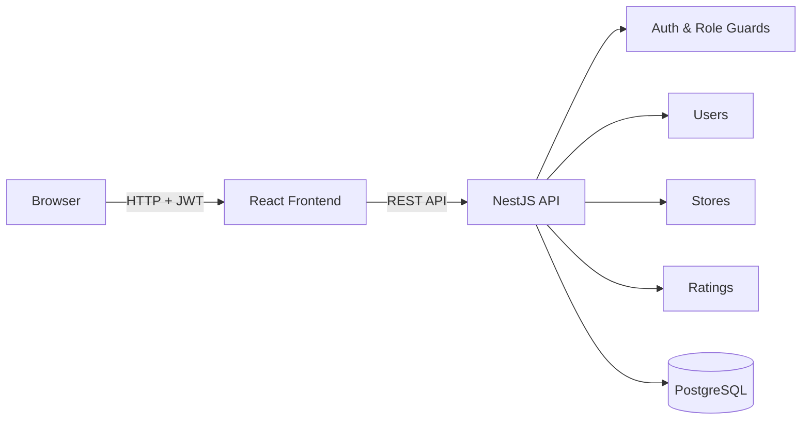
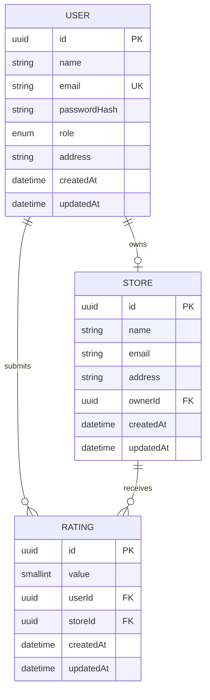
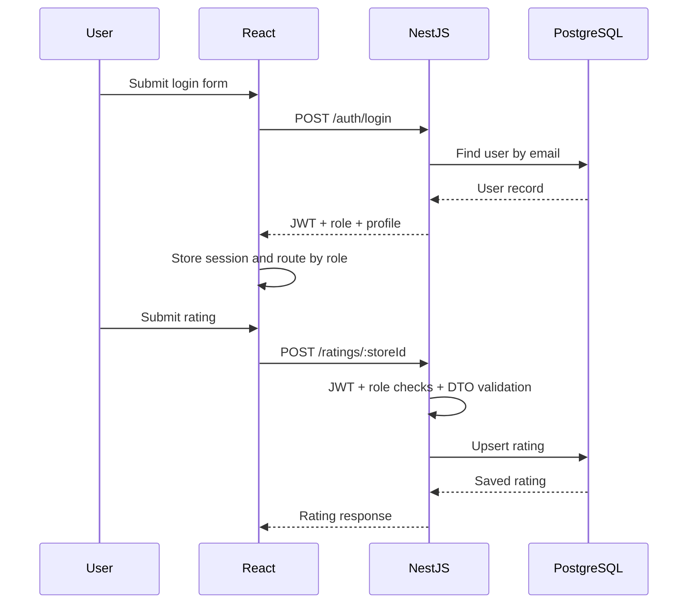

# Store Rating Platform

A role-based store rating web application built for the assessment brief. The project keeps one authentication flow for every account and switches the available screens and APIs according to the logged-in user's role.

## Stack

- **Backend:** NestJS + TypeScript
- **Database:** PostgreSQL
- **ORM:** Prisma
- **Frontend:** React + Vite
- **Auth:** JWT + bcrypt
- **API style:** REST
- **Local development:** Docker Compose

## What is covered

### System Administrator

- Dashboard with total users, stores, and ratings
- Create stores
- Create users with admin, normal-user, or store-owner roles
- Search/filter/sort user and store listings
- View a user's complete profile
- See store-owner rating information
- Log out

### Normal User

- Sign up and log in through the same login screen as every other role
- Search stores by name/address
- Sort store listings
- See the overall rating and their own submitted rating
- Submit a rating from 1–5
- Change an existing rating
- Change password
- Log out

### Store Owner

- Log in through the shared login screen
- View the average rating for the owned store
- See users who have submitted ratings and the rating they gave
- Sort/filter the ratings list
- Change password
- Log out

## Validation rules

| Field | Rule |
| --- | --- |
| User name | 20–60 characters |
| Address | Maximum 400 characters |
| Password | 8–16 characters, at least one uppercase character and one special character |
| Email | Standard email format |
| Rating | Integer from 1 to 5 |

## Architecture



The API is intentionally split by business capability instead of keeping all logic in one large controller. Authentication and authorization are cross-cutting concerns; store and rating rules live close to the relevant domain modules.

## Data model



A rating has a composite unique key on `(userId, storeId)`. That is the database-level rule that guarantees one submitted rating per user/store pair while still allowing the user to update it later.

## Request flow



## Project structure

```text
store-rating-platform/
├── client/                 # React application
│   ├── src/
│   │   ├── components/
│   │   ├── context/
│   │   ├── lib/
│   │   ├── pages/
│   │   ├── App.jsx
│   │   └── main.jsx
│   └── package.json
├── server/                 # NestJS application
│   ├── prisma/
│   │   ├── schema.prisma
│   │   └── seed.ts
│   ├── src/
│   │   ├── auth/
│   │   ├── common/
│   │   ├── ratings/
│   │   ├── stores/
│   │   ├── users/
│   │   └── main.ts
│   ├── test/
│   └── package.json
├── docker-compose.yml
├── .env.example
└── README.md
```

## Getting started

### 1. Prerequisites

- Node.js 22+
- npm 10+
- Docker Desktop (recommended for PostgreSQL)

### 2. Start PostgreSQL

```bash
docker compose up -d postgres
```

The database is exposed on `localhost:5432`.

### 3. Configure the server

```bash
cd server
cp .env.example .env
npm install
npx prisma generate
npx prisma migrate dev --name init
npm run prisma:seed
npm run start:dev
```

The API runs on `http://localhost:3000`.

### 4. Start the React app

Open a second terminal:

```bash
cd client
npm install
npm run dev
```

The web app runs on the Vite URL shown in the terminal, normally `http://localhost:5173`.

## Demo accounts

The seed script creates usable accounts so the role-based flows can be checked immediately.

| Role | Email | Password |
| --- | --- | --- |
| System Administrator | admin@ratinghub.local | `Admin@123` |
| Normal User | user@ratinghub.local | `User@123` |
| Store Owner | owner@ratinghub.local | `Owner@123` |

The seeded user names intentionally satisfy the 20-character minimum from the brief.

## REST API

### Authentication

| Method | Route | Access | Purpose |
| --- | --- | --- | --- |
| POST | `/auth/login` | Public | Shared login flow |
| POST | `/auth/signup` | Public | Create a normal user |
| PATCH | `/auth/password` | Authenticated | Change current password |
| GET | `/auth/me` | Authenticated | Return current session profile |

### Admin

| Method | Route | Access | Purpose |
| --- | --- | --- | --- |
| GET | `/admin/dashboard` | Admin | Dashboard counters |
| GET | `/admin/users` | Admin | Filtered/sorted user listing |
| POST | `/admin/users` | Admin | Create admin/user/store-owner account |
| GET | `/admin/users/:id` | Admin | Full user details |
| GET | `/admin/stores` | Admin | Filtered/sorted store listing |
| POST | `/admin/stores` | Admin | Create store |

### Stores and ratings

| Method | Route | Access | Purpose |
| --- | --- | --- | --- |
| GET | `/stores` | Authenticated | Store search/listing |
| POST | `/ratings/:storeId` | Normal user | Submit rating |
| PATCH | `/ratings/:storeId` | Normal user | Update rating |
| GET | `/owner/dashboard` | Store owner | Own store + submitted ratings |

## Filtering and sorting

The list endpoints accept query parameters such as:

```text
?name=mart&address=pune&role=USER&sortBy=name&sortOrder=asc&page=1&pageSize=10
```

The server validates sort fields against an allow-list rather than passing arbitrary column names into a query. Text filtering uses PostgreSQL case-insensitive matching through Prisma.
